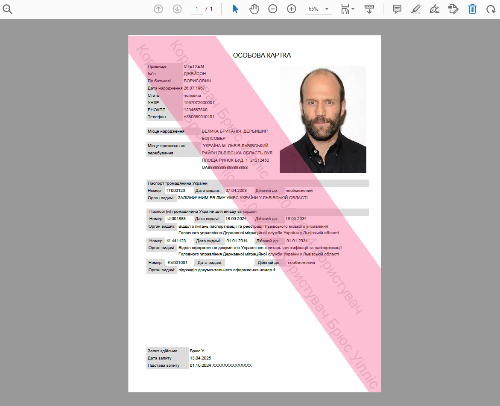

# easy_DMS

PDF person profile to MS Word document 

### Goals

The target documents contain uneven placement of elements and watermarks, which makes it difficult to extract information using conventional methods (such as a pdf miner). Testing by parsing the text stream showed that the extracted text is mixed between blocks and may lead to unpredictable distortion of results or loss (skipping) of data during further report generation.

Successful conversion of documents was achieved by converting the content of the PDF file into a graphic image followed by OCR processing. The position of the elements in the form of coordinates allows you to accurately extract the necessary part of the text in each case.

### PDF view

### Converted to MS Word

### Program execution

1. Reading *.pdf files
2. Converting to binary image
3. OCR processing
4. Regex extraction from OCR results
5. Writing MS Word document

### Proper libraries installation:
- pip uninstall fitz
- pip install PyMuPDF
- pip install Pillow

### Program assembly for Windows (*.exe)

pyinstaller --add-data "C:\_easy_dms\venv\Lib\site-packages;."  --icon C:/_easy_dms/bitmap.ico --name easy_dms C:/_easy_dms/main.py