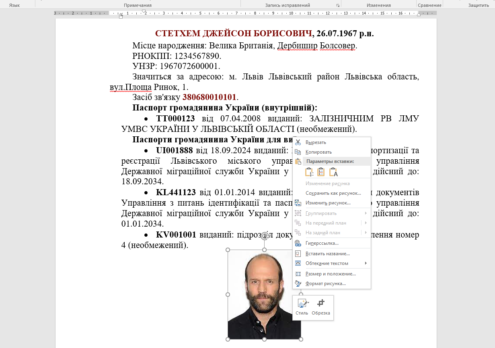
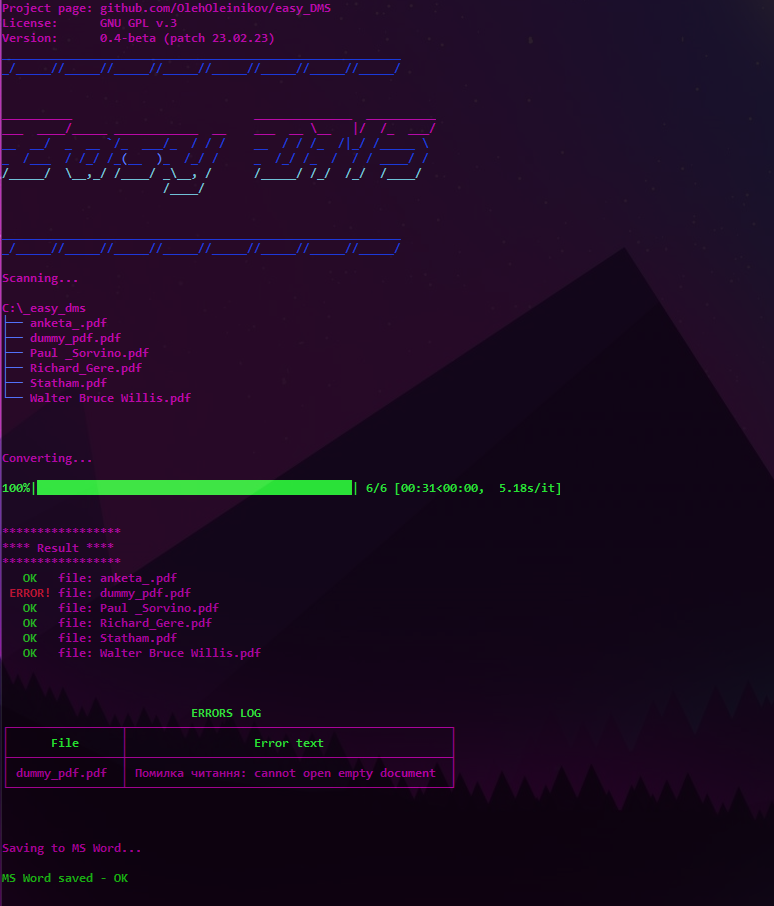

# easy_DMS

PDF person profile to MS Word document 

## SUBJECT

The target documents contain uneven placement of elements and watermarks, which makes it difficult to extract information using conventional methods (such as a pdf miner). Testing by parsing the text stream showed that the extracted text is mixed between blocks and may lead to unpredictable distortion of results or loss (skipping) of data during further report generation.

Successful conversion of documents was achieved by converting the content of the PDF file into a graphic image followed by OCR processing. The position of the elements in the form of coordinates allows you to accurately extract the necessary part of the text in each case.

## OCR processing

The tesseract module is used for these purposes. First of all, the PDF file is converted to cv2 format (image array). As a result of image processing, a dictionary is returned with coordinates of defined blocks and text values. Heading lines with some offset are defined for correct text selection.

### PDF overview

### Single row fields parsing

The first attribute located on the header line is extracted. The 'y' coordinate (with offsets) is used to determine the extraction limits. The expected placement of the attribute itself is limited by the 'x' coordinate. Accumulation of attributes is provided by the PersonProfile class

### Multiple row fields parsing

### Section parsing

## Convert to MS Word

## Program execution

1. Reading *.pdf files
2. Converting to binary image
3. OCR processing
4. Regex extraction from OCR results
5. Writing MS Word document

## App assemble 

### Used modules:
Main:
- fitz
- cv2
- pytesseract
- re
- python-docx

Additional:
- rich
- tqdm
- winsound

### Proper libraries installation:
- pip uninstall fitz
- pip install PyMuPDF
- pip install Pillow

### Program assembly for Windows (*.exe)

pyinstaller --add-data "C:\_easy_dms\venv\Lib\site-packages;." --add-data "C:\_easy_dms\tess;tess"  --paths "fullpath-to-custom-libraries" --onefile --noconfirm --icon C:/_easy_dms/app_icon.ico --name easy_dms C:/_easy_dms/main.py